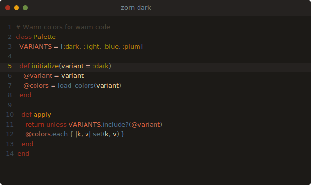
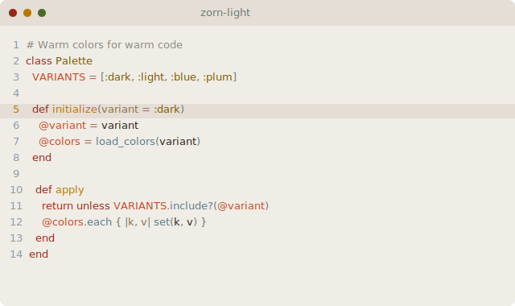
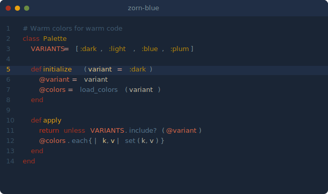
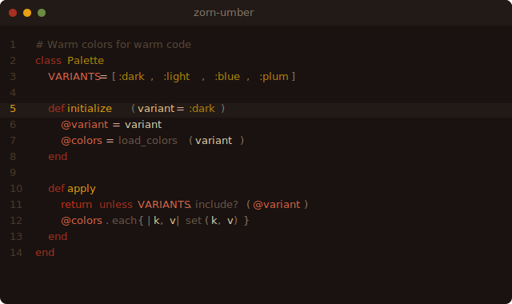
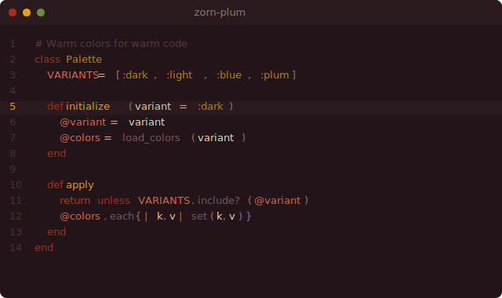

# zorn.nvim

A warm, earthy Neovim colorscheme with four variants. Named after the [Zorn palette](https://en.wikipedia.org/wiki/Anders_Zorn#Palette) — the limited set of colors (yellow ochre, ivory black, vermilion, and titanium white) used by the Swedish painter Anders Zorn.

## Variants

### Dark

The default. Warm blacks and parchment tones.



### Light

Inverted for daytime. Respects `vim.o.background = "light"`.



### Blue

Deep navy backgrounds with the same warm syntax colors.



### Umber

Burnt umber and dark wood. The shadowed interior of a Zorn painting.



### Plum

Rich plum-tinted darks for a moodier feel.



## Installation

### [lazy.nvim](https://github.com/folke/lazy.nvim)

```lua
{
  "michaeldanhari/zorn.nvim",
  lazy = false,
  priority = 1000,
  config = function()
    vim.cmd("colorscheme zorn-dark")
  end,
}
```

### Local

```lua
{ dir = "~/Code/zorn.nvim", lazy = false, priority = 1000 }
```

## Usage

```vim
:colorscheme zorn-dark
:colorscheme zorn-light
:colorscheme zorn-blue
:colorscheme zorn-umber
:colorscheme zorn-plum
```

Or use `:colorscheme zorn` to automatically select dark or light based on `vim.o.background`. On macOS, pair this with system appearance detection in your `init.lua`:

```lua
vim.o.background = vim.fn.system("defaults read -g AppleInterfaceStyle 2>/dev/null"):match("Dark") and "dark" or "light"
vim.cmd("colorscheme zorn")
```

## Supported Plugins

- [Telescope](https://github.com/nvim-telescope/telescope.nvim)
- [nvim-tree](https://github.com/nvim-tree/nvim-tree.lua)
- [Gitsigns](https://github.com/lewis6991/gitsigns.nvim)
- [Neotest](https://github.com/nvim-neotest/neotest)
- [Which-key](https://github.com/folke/which-key.nvim)
- Treesitter
- LSP Diagnostics

LSP semantic tokens are cleared by the theme so that Treesitter highlighting takes full control of syntax colors.
